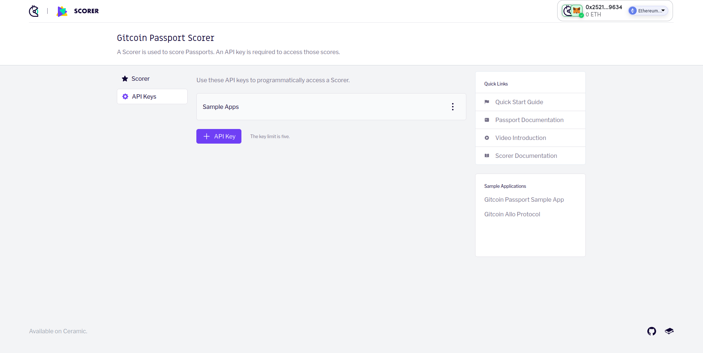
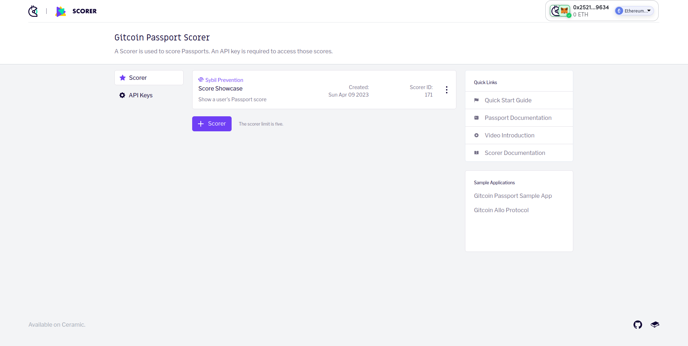

# AirDrop

## Introduction

This sample app connects to a user's wallet, then fetches their passport score from the passport scorer API and uses it to determine if they are allowed to claim an airdrop.

## Getting Started

### Create your API key and Scorer

1. Create your API key by going to [Gitcoin Passport Scorer](https://scorer.gitcoin.co) and clicking on the "API Keys" section.
   Then create a `.env.local` file and copy the contents of the `example.local.env` file into it.
   Replace `SCORER_API_KEY` with your API key.



2. Create a Scorer, by clicking on the "Scorer" section.
   Replace `NEXT_PUBLIC_SCORER_ID` with your Scorer ID in `.env.local`.



3. Run migrations `npx knex migrate:latest` for dev

Run migrations `npx knex migrate:latest --env production` for production

4. get app ID from https://www.alchemy.com/
Replace `ALCHEMY_ID` with your app ID in `.env.local`.

5. update faucet config in `.env.local`
NEXT_PUBLIC_FAUCET_AMOUNT
NEXT_PUBLIC_MNEMONIC
NEXT_PUBLIC_GGX_WS_URL
FAUCET_AMOUNT_LIMIT_PER_ADDRESS

### Start the app

Now you can start the app by running:

```bash
npm install
```

then

for dev:
```bash
npm run dev
```

for production:
```bash
npm run build && npm run start
```

Finally, you can navigate to `http://localhost:3000` to view the sample app.

### Layout

Most of the logic for connecting to the passport scorer API can be found in `/components/AirDrop.js`

Inside this component we:

1. Fetch a message and nonce from the scorer API.
2. Prompt the user to sign the message.
3. Submit the user's passport for scoring.
4. Fetch the user's passport score.
5. Use the score to determine if they are eligible for the airdrop.

All of the interaction with the scorer API is proxied through our endpoints in `/pages/api`. This is done to prevent our `SCORER_API_KEY` env variable from being exposed to the frontend.
